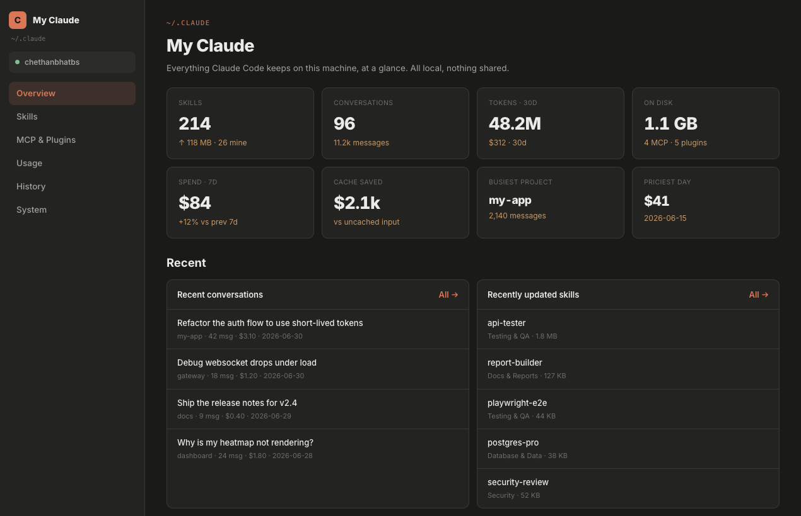

# My Claude

A private, **local** dashboard for everything Claude Code keeps on your machine - skills, MCP
connectors, plugins, token usage and cost, and your full conversation history - in one place you can
actually read.

**Website:** https://my-claude.pages.dev/ · **Live demo:** https://my-claude.pages.dev/demo.html



## Install (one command)

```bash
curl -fsSL https://my-claude.pages.dev/install.sh | bash
```

Paste that into your terminal. It downloads the app, sets up an isolated Python environment
(one-time, ~20 seconds), and opens the dashboard at `http://127.0.0.1:8766` - or the next free port
if that one's busy.

> **First launch can take a moment.** The browser opens once the server is ready, but the very first
> run builds a Python environment and indexes your `~/.claude` folder. If your browser briefly shows
> **"This site can't be reached"**, the local server is just still starting - wait a few seconds and
> refresh, and it will load.

**Needs:** Python 3.9+ on macOS. Inspect the script first:
[`install.sh`](https://github.com/chethanbhatbs/my-claude/blob/main/install.sh).

## Your data never leaves your machine

It binds to `127.0.0.1` only, runs entirely on your machine, and makes **no calls on its own** - no
telemetry, no cloud. The only data that ever leaves is what you explicitly push or share to your own
GitHub. Secrets in MCP configs are auto-redacted before they're shown. You share the tool, not your data.

## What you get

- **Overview** - skills, conversations, token spend, and disk use at a glance.
- **Usage** - cost and tokens by day, model, and project, with cache-savings.
- **Skills** - every skill, how often you use it, and which ones you never touch; search across all
  of them, read any `SKILL.md`, and push to GitHub or share as a `.zip`.
- **MCP & Plugins** - your connectors (global and per-project) with a one-click health check.
- **History** - full-text search across every transcript with per-conversation cost; resume in
  Claude or export to Markdown.
- **System** - permissions, hooks, `CLAUDE.md`, and the memory Claude carries between sessions.

Connect GitHub straight from the app (device-code flow via your `gh` CLI - no tokens stored),
copy any code block, and switch between light and dark themes.

## Try it first

Open the [live demo](https://my-claude.pages.dev/demo.html) - the real UI with sample
data, nothing from your machine.

## Prefer to install manually?

Download [`my-claude-dashboard.zip`](https://my-claude.pages.dev/my-claude-dashboard.zip),
unzip it, and run `./run.sh`.

## License

MIT.

---

Built with Claude Code.
